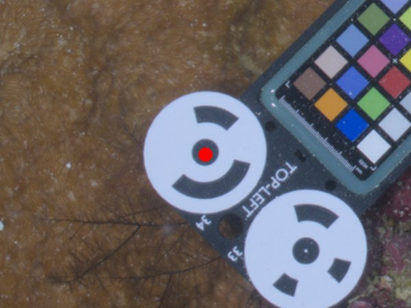
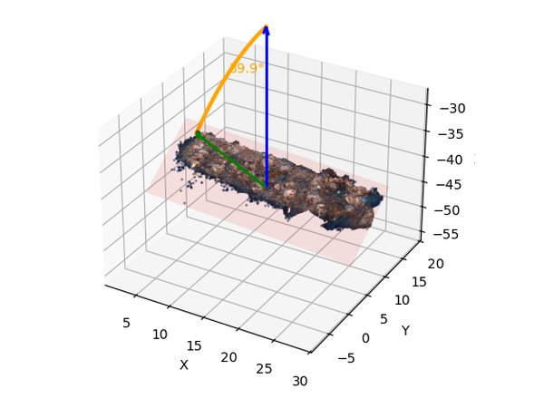
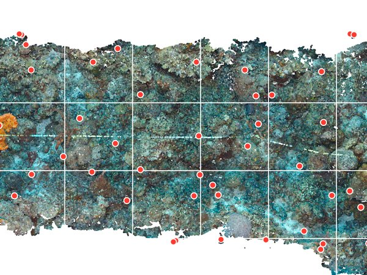
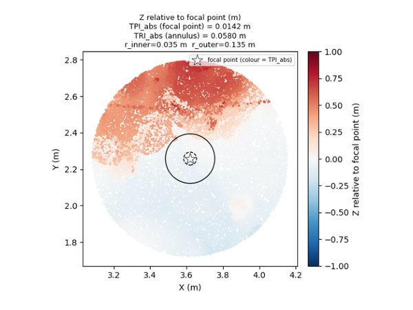
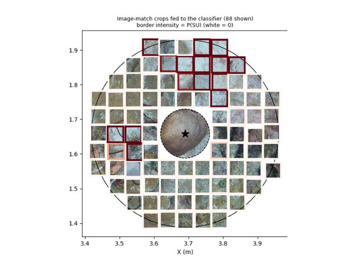
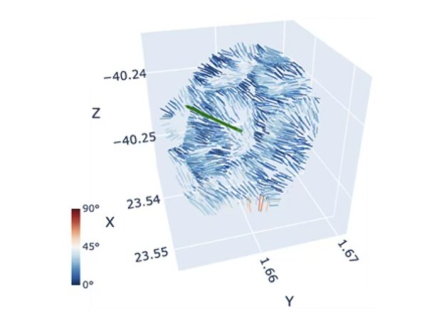

<h1 align="center">substrata 🪸</h1>

<p align="center">
  <strong>3-D point-cloud analysis for coral reef photogrammetry</strong><br>
  From structure-from-motion reconstructions to quantitative colony-level metrics.
</p>

<div align="center">

[](https://substrata.readthedocs.io/en/latest/)
[](https://www.python.org/)
[](LICENSE)
[](https://github.com/reefscapegenomics/substrata/commits/main)
[](#development-status)

[Documentation](https://substrata.readthedocs.io/en/latest/) ·
[Getting started](https://substrata.readthedocs.io/en/latest/getting_started.html) ·
[Command line](https://substrata.readthedocs.io/en/latest/command_line_usage.html) ·
[API reference](https://substrata.readthedocs.io/en/latest/api.html) ·
[Citation](#citation)

</div>

---

**substrata** is a Python package and command-line tool for processing and
analyzing 3-D reconstructions of coral reefs. It takes the outputs of a
structure-from-motion (SfM) pipeline (dense point clouds, camera poses, and 3-D
or 2-D annotations), scales and orients the model, and then calculates terrain
and ecological measures from either the 3-D neighborhood of annotated colonies
or the original 2-D photographs.

**substrata** is built for large-area reef imaging (from 100 m² to hectare-sized
plots), where a single model can consist of billions of 3-D points and
thousands of images. When a model exceeds available memory, a decimated version
can serve as a proxy, or a hybrid approach can be used in which streaming PLY
tools sample only the local neighborhood of each colony at full resolution. The
tight coupling between 3-D annotations and the original 2-D photographs allows
measurements across both.

**substrata** is developed by the Reefscape Genomics Lab for our research,
where it is mostly used alongside genomic analyses. We share it openly in the
hope that it is useful to others, but we can offer only limited support. The
package is designed for scripted, reproducible workflows, so it assumes some
familiarity with the command line and/or Python. It does not aim to provide
interactive visualization; for that, we recommend dedicated tools
such as [Viscore](https://chei.ucsd.edu/viscore/) for point clouds, or
[TagLab](https://github.com/cnr-isti-vclab/TagLab) and
[CoralNet-Toolbox](https://github.com/Jordan-Pierce/CoralNet-Toolbox) for orthomosaics 
and images.

> [!NOTE]
> substrata is under active development. See
> [Development status](#development-status) for details.

## 🖼️ At a glance

<div align="center">

| <a href="https://substrata.readthedocs.io/en/latest/notebooks/scaling_and_orientation.html"></a><br>**🎨 Scaling and color correction** | <a href="https://substrata.readthedocs.io/en/latest/notebooks/scaling_and_orientation.html"></a><br>**🧭 Depth-referenced orientation** | <a href="https://substrata.readthedocs.io/en/latest/notebooks/segment_pointcloud.html"></a><br>**🎯 Point intercept classification** |
|:---:|:---:|:---:|
| <a href="https://substrata.readthedocs.io/en/latest/notebooks/measurements_tpi.html"></a><br>**⛰️ Terrain metrics** | <a href="https://substrata.readthedocs.io/en/latest/notebooks/measurements_benthic_fraction.html"></a><br>**🐠 Ecological metrics** | <br>**📐 Morphological metrics** |

<sub>Click an image to open the related tutorial.</sub>

</div>

## ✨ Features

| Area | What substrata does |
| --- | --- |
| **Point clouds** | Load, decimate, repair, and stream very large PLY files without holding them in memory. |
| **Scaling & orientation** | Recover real-world scale from scalebar targets and orient a reconstruction into a vertically aligned, depth-referenced world frame. Additional options for automated color calibration from a Color Checker card. |
| **Cameras** | Read Agisoft Metashape camera poses and sensors, find the images that see a given 3-D point (and vice versa), and sync between cameras and/or sensors. |
| **Annotations** | Manage labeled features (e.g. individual coral colonies) or generate random and stratified point annotations. Project 3-D points into images and ray-cast 2-D image annotations back onto the point cloud to transfer annotations between overlapping reconstructions. |
| **Classification** | Train image-patch classifiers on labeled annotations for automated classification, segment coral colonies in images, and segment point clouds into benthic categories. |
| **Measurements** | Terrain and ecological metrics: e.g. topographic position index (TPI), terrain ruggedness index (TRI), rugosity, fractal dimension, surface area, gap fraction, benthic cover, and depth regression. |
| **Visualization** | Orthographic plot maps, multi-plot figures (e.g. depth transects), composite views, and PDF QC reports. |

## ⚡ Installation

substrata depends on native libraries (Open3D, OpenCV, PyTorch) that are best
installed with [conda](https://docs.conda.io/):

```bash
git clone https://github.com/reefscapegenomics/substrata.git
cd substrata
conda env create -f environment.yml
conda activate substrata
python -m pip install -e .
```

Check that the installation works:

```bash
substrata --help
```

See the [installation guide](https://substrata.readthedocs.io/en/latest/installation.html)
for details and troubleshooting.

## 🚀 Quick start

substrata is flexible in how data are organized, but its standard convention
is to group data into **projects**: one directory per reconstruction, named
`<site>_<location>_<depth>_<date>` (e.g. `cur_sna_20m_20200303`). Files inside
follow the same prefix and are detected automatically:

```text
cur_sna_20m_20200303/
├── cur_sna_20m_20200303.yaml          # project file: scale, orientation, file paths
├── cur_sna_20m_20200303.ply           # dense point cloud
├── cur_sna_20m_20200303_dec50M.ply    # decimated point cloud
├── cur_sna_20m_20200303.cams.xml      # camera poses and sensors (Metashape)
├── cur_sna_20m_20200303_markers.csv   # scalebar target markers
└── cur_sna_20m_20200303_ann.csv       # annotations
```

See [Projects](https://substrata.readthedocs.io/en/latest/projects.html) for
the full layout and the YAML schema.

**From the command line.** Most subcommands auto-detect the project from the
current directory:

```bash
substrata metashape-export --psx cur_sna_20m_20200303.psx   # create the project
cd cur_sna_20m_20200303
substrata orient       # compute scale and orientation, save to the project YAML
substrata scalebars    # PDF report of the scalebar fit
substrata views        # PDF of composite views of the point cloud
```

**From Python:**

```python
from substrata import *

proj = ProjectInitializer(path="/data/cur_sna_20m_20200303")
proj.initialize()        # loads data and applies the stored scale and orientation

proj.pcd                 # PointCloud
proj.cams                # Cameras
proj.annotations         # Annotations
```

## 📚 Tutorials

These Jupyter notebooks walk through several workflows and are rendered in the
[documentation](https://substrata.readthedocs.io/en/latest/). They are still
being written and cover only some features, so some sections are brief or
incomplete. The [API reference](https://substrata.readthedocs.io/en/latest/api.html)
documents all public functions.

| Tutorial | Description |
| --- | --- |
| [Scaling and orientation](https://substrata.readthedocs.io/en/latest/notebooks/scaling_and_orientation.html) | Scale and orient a point cloud from scalebar markers |
| [Transferring annotations](https://substrata.readthedocs.io/en/latest/notebooks/transferring_annotations.html) | Transfer annotations between overlapping reconstructions |
| [TPI and TRI](https://substrata.readthedocs.io/en/latest/notebooks/measurements_tpi.html) | Topographic position index and terrain ruggedness index |
| [Benthic fraction](https://substrata.readthedocs.io/en/latest/notebooks/measurements_benthic_fraction.html) | Cover of a target benthic class around annotations |
| [Point-cloud segmentation](https://substrata.readthedocs.io/en/latest/notebooks/segment_pointcloud.html) | Classify the image patch behind each point and recolor by category |
| [Multi-plot figures](https://substrata.readthedocs.io/en/latest/notebooks/multiplots.html) | Stack several plots (e.g. a depth transect) into one orthographic figure |

## 🧰 Command-line tools

<details>
<summary>Show all subcommands</summary>

| Task | Subcommands |
| --- | --- |
| Project setup | `metashape-export`, `path-repair` |
| Point-cloud files | `decimate`, `ply-repair`, `head` |
| Scaling & orientation | `orient`, `scalebars`, `firefish`, `transform`, `align` |
| Cameras & images | `camsync`, `images`, `cams2video` |
| Color calibration | `colors` |
| Annotations & sampling | `intercepts`, `intercepts-plot`, `match-annotations` |
| Classification | `train`, `segment` |
| Visualization | `views` |

</details>

Run `substrata <subcommand> --help` for options, or see the
[command-line documentation](https://substrata.readthedocs.io/en/latest/command_line_usage.html).

<a id="development-status"></a>

## 🚧 Development status

substrata is under active development. Its core workflows (scaling,
orientation, annotation, and measurement) are used in our own research, but the
API, command-line options, and default parameters may still change between
versions, and the documentation and tutorials are incomplete.

Bug reports, questions, and feature requests are welcome on the
[issue tracker](https://github.com/reefscapegenomics/substrata/issues).

<a id="citation"></a>

## 📄 Citation

If you use substrata in your research, please cite it as:

```bibtex
@software{substrata,
  author  = {Bongaerts, Pim},
  title   = {substrata: 3-D point-cloud analysis for coral reef photogrammetry},
  year    = {2026},
  version = {0.1.0},
  url     = {https://github.com/reefscapegenomics/substrata}
}
```

GitHub's **Cite this repository** button (from [`CITATION.cff`](CITATION.cff))
gives the same reference in other formats.

> **Using substrata in a publication?** Let us know by opening an
> [issue](https://github.com/reefscapegenomics/substrata/issues), and we will
> list it here.

## 🙏 Authors and acknowledgements

substrata is developed and maintained by
[Pim Bongaerts](https://orcid.org/0000-0001-6747-6044)
([Reefscape Genomics Lab](https://github.com/reefscapegenomics), California
Academy of Sciences).

It has benefited from ideas and contributions from the following present and
former members of the Reefscape Genomics Lab (in alphabetical order):

- Alejandra Hernández: annotation and classification workflow
- Phaedra Hernández: annotation and classification workflow
- Jennifer Hoey: terrain measures and visualizations
- Dennis van Hulten: stratified random point sampling and roughness measures
- Maxine Mouly: terrain measures and visualizations
- Katharine Prata: initial workflow and up-vector alignment
- Flore Wijnands: time-series visualizations

Parts of substrata were developed with the help of AI coding assistants, mainly Cursor
and Anthropic's Claude (via [Claude Code](https://claude.com/claude-code)). They were 
used to draft and refactor code, write tests, and prepare documentation. All AI-assisted
 changes were directed, reviewed, and tested by the maintainer.

## ⚖️ License

substrata is released under the [MIT License](LICENSE).
Copyright © 2024-2026 California Academy of Sciences.
